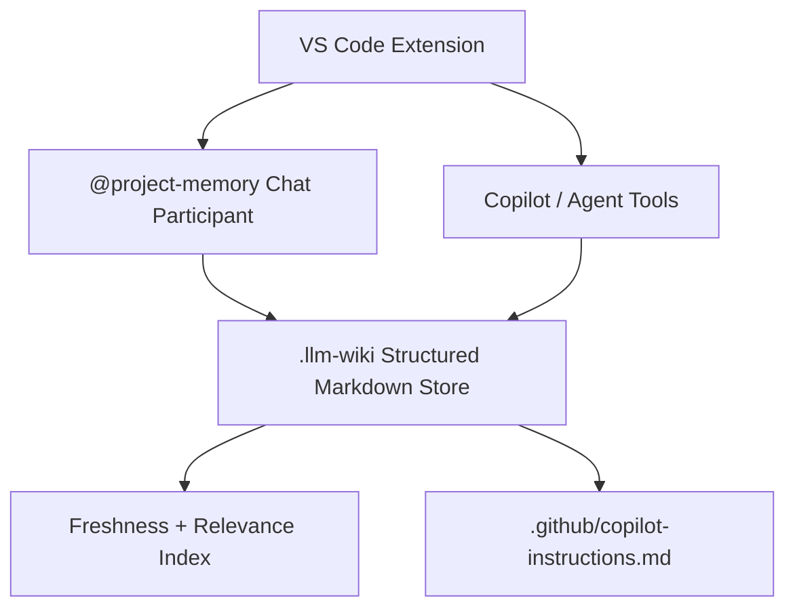

# Dixie Flatline

Dixie Flatline is a VS Code extension that gives a repository a structured, time-aware memory layer for GitHub Copilot and agent workflows.

It is not a simple LLM wiki. It stores typed decisions, facts, assumptions, known issues, and open questions in version-controlled Markdown, retrieves context by file relevance, importance, confidence, and freshness, and compiles high-impact memory into `.github/copilot-instructions.md`.



## MVP Scope

- Initialise a repo-local `.llm-wiki/` memory structure.
- Store typed memory entries with importance, confidence, freshness, sources, and supersession metadata.
- Search memory by path, tags, text similarity, importance, confidence, and freshness.
- Track conflicts and unresolved questions without flattening ambiguity.
- Answer `@project-memory` chat prompts with cited memory entries.
- Expose Copilot language-model tools for relevant memory, critical decisions, conflicts, questions, diff updates, and instruction generation.
- Generate `.github/copilot-instructions.md` from critical/high-importance memory.

## Workspace

This repo is an Nx workspace with one VS Code extension app:

```txt
apps/
  project-memory-extension/
    package.json
    src/
      extension.ts
      memory/
      chat/
      tools/
```

## Getting Started

```bash
pnpm install
pnpm build
pnpm typecheck
pnpm test
```

To package a VSIX:

```bash
pnpm package
```

## Commands

- `Dixie Flatline: Initialise`
- `Dixie Flatline: Rebuild Index`
- `Dixie Flatline: Generate Instructions`
- `Dixie Flatline: Update Memory from Diff`

## Tool Interface

```ts
getRelevantMemory(filePath: string)
getCriticalDecisions()
recordDecision(input)
updateMemoryFromDiff(diff)
findConflicts(topic: string)
getOpenQuestions()
generateCopilotInstructions()
```

## Chat Participant

Use `@project-memory` in VS Code chat:

```txt
@project-memory explain this file
@project-memory what decisions affect this module
@project-memory summarise auth flow
@project-memory update memory from current changes
```

## Memory Layout

```txt
.llm-wiki/
  memory/
    architecture.md
    decisions.md
    conventions.md
    domain-model.md
    testing.md
    known-issues.md
    open-questions.md
  sources/
    pr-notes/
    issue-notes/
    extracted-symbols/
  index/
    file-map.json

.github/
  copilot-instructions.md
  instructions/
```
