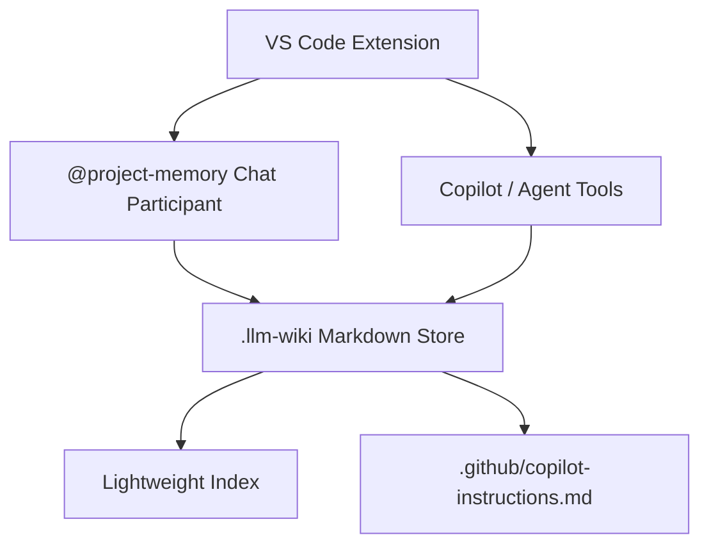

# Dixie Flatline

Dixie Flatline is a VS Code extension that gives a repository a small, durable memory layer for GitHub Copilot and agent workflows.

It stores architectural knowledge in version-controlled Markdown, retrieves relevant context for active files, and generates `.github/copilot-instructions.md` from the current memory set.



## MVP Scope

- Initialise a repo-local `.llm-wiki/` memory structure.
- Search Markdown memory by path, tags, and text similarity.
- Answer `@project-memory` chat prompts with cited memory entries.
- Expose Copilot language-model tools for memory search, decisions, diff updates, and instruction generation.
- Generate `.github/copilot-instructions.md` from accepted decisions and conventions.

## Workspace

This repo is an Nx workspace with one VS Code extension app:

```txt
apps/
  project-memory-extension/
    package.json
    src/
      extension.ts
      memory/
      chat/
      tools/
```

## Getting Started

```bash
pnpm install
pnpm build
pnpm typecheck
pnpm test
```

To package a VSIX:

```bash
pnpm package
```

## Commands

- `Dixie Flatline: Initialise`
- `Dixie Flatline: Rebuild Index`
- `Dixie Flatline: Generate Instructions`
- `Dixie Flatline: Update Memory from Diff`

## Chat Participant

Use `@project-memory` in VS Code chat:

```txt
@project-memory explain this file
@project-memory what decisions affect this module
@project-memory summarise auth flow
@project-memory update memory from current changes
```

## Memory Layout

```txt
.llm-wiki/
  memory/
    architecture.md
    decisions.md
    conventions.md
    domain-model.md
    testing.md
    known-issues.md
  sources/
    pr-notes/
    issue-notes/
    extracted-symbols/
  index/
    file-map.json

.github/
  copilot-instructions.md
  instructions/
```
