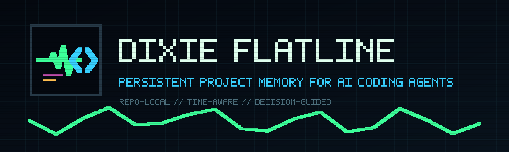
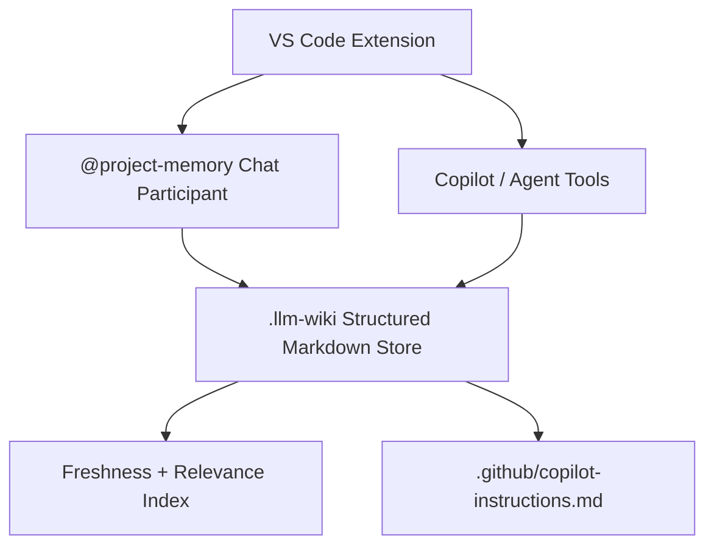

# Dixie Flatline



> Persistent project memory for AI coding agents.

Dixie Flatline helps your AI coding assistant remember how your project actually works.

It is not a simple LLM wiki. It stores typed decisions, facts, assumptions, known issues, and open questions in version-controlled Markdown, retrieves context by file relevance, importance, confidence, and freshness, and compiles high-impact memory into `.github/copilot-instructions.md`.

## Status

Experimental VS Code extension for repo-local AI memory.

Not production-ready. APIs and schema may change.

If you want to try it without building from source, install a VSIX from GitHub Releases.



## MVP Scope

- Initialise a repo-local `.llm-wiki/` memory structure.
- Store typed memory entries with importance, confidence, freshness, sources, and supersession metadata.
- Search memory by path, tags, text similarity, importance, confidence, and freshness.
- Track conflicts and unresolved questions without flattening ambiguity.
- Answer `@project-memory` chat prompts with cited memory entries.
- Expose Copilot language-model tools for relevant memory, critical decisions, conflicts, questions, diff updates, and instruction generation.
- Generate `.github/copilot-instructions.md` from critical/high-importance memory.

## Workspace

This repo is an Nx workspace with one VS Code extension app:

```txt
apps/
  project-memory-extension/
    package.json
    src/
      extension.ts
      memory/
      chat/
      tools/
```

## Try A Release Build

Download a `.vsix` asset from [GitHub Releases](https://github.com/CambridgeMonorail/dixie-flatline/releases).

- For the current public build, use [v0.1.0](https://github.com/CambridgeMonorail/dixie-flatline/releases/tag/v0.1.0).
- For dev builds, look for releases marked `Pre-release` and download the attached `.vsix` asset.

Install the downloaded VSIX with either:

```bash
code --install-extension path/to/dixie-flatline.vsix
```

Or from VS Code with `Extensions: Install from VSIX...`.

## First Run

After installing the extension, open the repository you want to use with Dixie Flatline and run:

```txt
Dixie Flatline: Initialise
```

This creates the repo-local `.llm-wiki/` memory structure that Dixie Flatline uses for stored project memory and generated instructions.

Once initialised, the main next steps are:

- Ask `@project-memory` about the active file or project decisions.
- Run `Dixie Flatline: Generate Instructions` to write `.github/copilot-instructions.md`.
- Run `Dixie Flatline: Update Memory from Diff` to review suggested memory updates from current changes.

## Privacy And Data Flow

- Dixie Flatline stores project memory in local Markdown files under `.llm-wiki/` inside your repository.
- Dixie Flatline generates `.github/copilot-instructions.md` in your repository from that local memory.
- Dixie Flatline does not send your project memory to a Dixie Flatline hosted service because no hosted service is included.
- Dixie Flatline does not require an external database or vector store.
- Copilot chat and language-model tool usage still depends on your VS Code and GitHub Copilot setup.

## Build From Source

```bash
pnpm install
pnpm lint
pnpm test
pnpm build
```

To package a VSIX:

```bash
pnpm package
```

## Commands

- `Dixie Flatline: Initialise`
- `Dixie Flatline: Rebuild Index`
- `Dixie Flatline: Generate Instructions`
- `Dixie Flatline: Update Memory from Diff`

## Limitations

- Diff-to-memory updates are heuristic and suggest actions rather than auto-applying them.
- Conflict detection is metadata and keyword based.
- Extension-host tests are not wired yet.
- No external vector database or hosted service is included.

## Tool Interface

```ts
getRelevantMemory(filePath: string)
getCriticalDecisions()
recordDecision(input)
updateMemoryFromDiff(diff)
findConflicts(topic: string)
getOpenQuestions()
generateCopilotInstructions()
```

## Chat Participant

Use `@project-memory` in VS Code chat:

```txt
@project-memory explain this file
@project-memory what decisions affect this module
@project-memory summarise auth flow
@project-memory update memory from current changes
```

## Memory Layout

```txt
.llm-wiki/
  memory/
    architecture.md
    decisions.md
    conventions.md
    domain-model.md
    testing.md
    known-issues.md
    open-questions.md
  sources/
    pr-notes/
    issue-notes/
    extracted-symbols/
  index/
    file-map.json

.github/
  copilot-instructions.md
  instructions/
```

## Roadmap

See [docs/roadmap.md](docs/roadmap.md).

## Brand Assets

Logo, icon, README header, and social preview assets live in [docs/brand](docs/brand).

## Public Launch Notes

See [docs/public-launch-checklist.md](docs/public-launch-checklist.md) before changing repository visibility.
